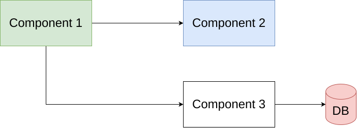

# Overview

- Basic slide structure
- Text, lists, and quotes
- Columns and images
- Code, tables, and callouts
- Speaker notes and backup slides

# Basic Content

## Simple Bullets

- Use concise slide titles
- Keep each slide focused
- Mix text and visuals
- Add speaker notes when useful

## Emphasis

This slide demonstrates **bold text**, *italic text*, `inline code`, and a link to
[Quarto](https://quarto.org/).

> A presentation system should make common slide patterns easy to write and easy
> to maintain.

::: {.notes}
Speaker notes can hold details that should not be visible on the projected
slide. They are useful for timing, reminders, and alternate explanations.
:::

# Layouts

## Two Columns

:::: {.columns}

::: {.column width="50%"}

**Left column**

- Main idea
- Supporting point
- Short example

:::

::: {.column width="50%"}

**Right column**

- Related detail
- Follow-up point
- Small conclusion

:::

::::

## Image and Text

:::: {.columns}

::: {.column width="58%"}

The presentation can combine explanatory text with local graphics. This example
references an image that exists in `presentation/img`.

- Local asset
- Centered figure
- Controlled width

:::

::: {.column width="42%"}

{width=100% fig-align="center"}

:::

::::

## Speaker Image

{width=38% fig-align="center"}

# Technical Slides

## Code Example

```python
def summarize(items):
    return {
        "count": len(items),
        "first": items[0] if items else None,
    }
```

## Table Example

| Capability | Example |
| --- | --- |
| Markdown slides | Headings create sections and slides |
| Columns | Side-by-side content blocks |
| Figures | Local graphics from `img/` |
| Notes | Presenter-only context |

## Callout Example

::: {.callout-tip}
Use callouts for short highlights, warnings, or decisions that should stand out
from the surrounding slide content.
:::

# Visual Assets

## Presentation Logo

{width=42% fig-align="center"}

## QR Codes

:::: {.columns}

::: {.column width="50%"}

{width=70% fig-align="center"}

:::

::: {.column width="50%"}

{width=70% fig-align="center"}

:::

::::

# Summary

## Takeaway

- Write slides in a readable source format
- Reuse local assets
- Combine text, code, tables, figures, and notes
- Keep the deck easy to review and update

# Backup Slides

## Backup: Checklist

- Confirm title and metadata
- Check image paths
- Render the deck
- Review speaker notes

## Backup: Extra Notes

This slide is intentionally generic. It can be used to verify that backup slides,
navigation, and export workflows behave as expected.
